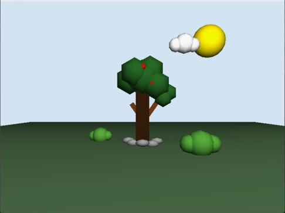
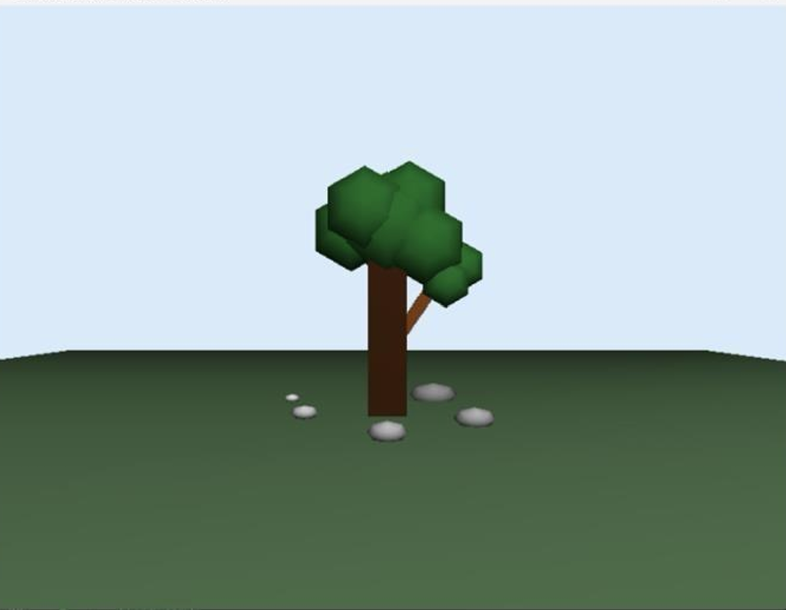

# Computer Graphics Project

A C++ and OpenGL project showcasing a 3D natural environment with lighting, camera transformations, and interactive graphics.

---

## Project Overview

This project demonstrates the implementation of a 3D natural environment using OpenGL and C++. It applies fundamental computer graphics concepts including object modeling, transformations, lighting, depth testing, and camera positioning to create an interactive virtual scene.

The project was developed as part of a Computer Graphics course to strengthen understanding of graphics programming and the OpenGL rendering pipeline.

---

## Objectives

- Build a 3D natural environment using OpenGL
- Apply geometric transformations
- Implement lighting and depth testing
- Create reusable 3D objects
- Practice computer graphics programming concepts

---

## Technologies Used

- C++
- OpenGL
- GLUT

---

## Repository Structure

```
docs/
├── Computer_Graphics_Project_Report.pdf

images/
├── scene-overview.png
├── lighting-and-depth.png
```

---

## Documentation

### Project Report

`docs/Computer_Graphics_Project_Report.pdf`

---

## Project Screenshots

### Scene Overview



### Lighting and Depth Testing



---

## Notes

This repository contains academic work completed as part of a Computer Graphics course. Personal information has been removed before publication.
